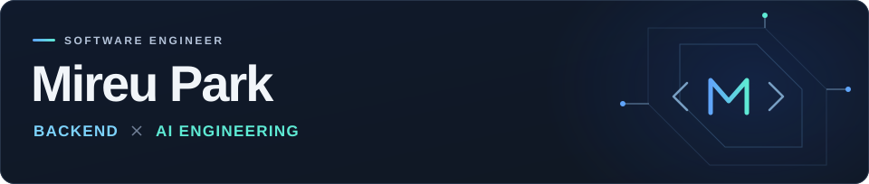

<picture>
  <source media="(max-width: 600px)" srcset="./assets/profile-header-mobile.svg">
  
</picture>

  백엔드 시스템을 만들고, AI를 서비스로 연결합니다. 
  박미르 · Software Engineer

### Tech Stack

  
  

### Explore

  <strong><a href="https://github.com/NIGHTPURI/Chat-Moderation">Chat&nbsp;Moderation&nbsp;↗</a></strong>&nbsp;&nbsp;·&nbsp;&nbsp;
  <strong><a href="https://github.com/NIGHTPURI/docinsight-ai">DocInsight&nbsp;AI&nbsp;↗</a></strong>

  ALGORITHMS&nbsp;&nbsp;·&nbsp;&nbsp;
  <a href="https://github.com/NIGHTPURI/CodeTree">CodeTree&nbsp;↗</a>&nbsp;&nbsp;/&nbsp;&nbsp;
  <a href="https://github.com/NIGHTPURI/Practice">Practice&nbsp;↗</a>

