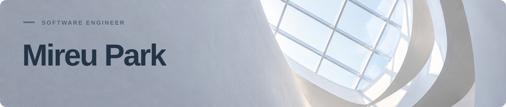

  백엔드 시스템을 만들고, AI를 서비스로 연결합니다. 
  박미르 · Software Engineer

### Tech Stack

  
  

### Explore

  <strong><a href="https://github.com/NIGHTPURI/Chat-Moderation">Chat&nbsp;Moderation&nbsp;↗</a></strong>&nbsp;&nbsp;·&nbsp;&nbsp;
  <strong><a href="https://github.com/NIGHTPURI/docinsight-ai">DocInsight&nbsp;AI&nbsp;↗</a></strong>

  <strong><a href="https://github.com/NIGHTPURI/incident-lens">IncidentLens</a></strong> · Java/Spring Boot 백엔드 학습 프로젝트 
  MySQL·Redis·Kafka를 지나는 주문 처리와 장애·복구 흐름을 실험하고, 수집한 근거로 원인을 분석하는 프로젝트입니다. AI 코딩 도구를 활용해 개발하며, 설계와 검증 과정을 기록합니다.

  ALGORITHMS&nbsp;&nbsp;·&nbsp;&nbsp;
  <a href="https://github.com/NIGHTPURI/CodeTree">CodeTree&nbsp;↗</a>&nbsp;&nbsp;/&nbsp;&nbsp;
  <a href="https://github.com/NIGHTPURI/Practice">Practice&nbsp;↗</a>

